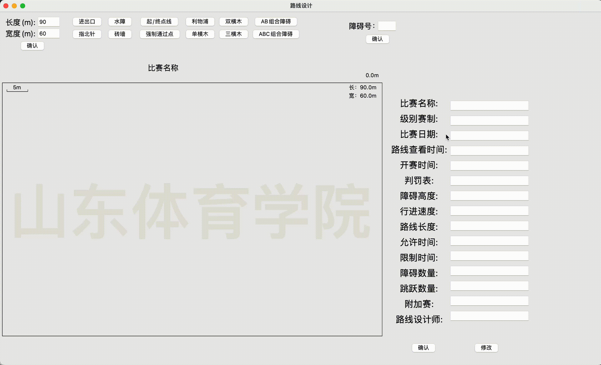

# Route_design
> 马术路线设计,通过拖拽快速制作马术路线图
## 功能概览
1. 自定义障碍号(如:1, 1a 等),支持移动，删除
2. 自定义比赛名称,居中显示
3. 能够点击生成障碍杆(支持移动、旋转,修改)
4. 自定义比赛场地大小(默认60x90),右上角显示实时大小,左上角显示比例
5. 场地右侧能自定义比赛信息(支持确认后修改),可以随着场地的距离而改变位置
6. 场地支持画图功能(指针拖动、铅笔、橡皮擦、清屏、撤销、通用字号、单独设置字号(后设置的优先级高))
7. 保存(包含右侧赛事信息，不包含右侧赛事信息，两种模式)
8. 放置

## 功能详情
### 自定义障碍号
在输入框中输入障碍号，点击确定，会在路线图中的左侧显示出来，可以通过鼠标拖动移动，鼠标右键点击删除.
### 自定义比赛名称
在右侧比赛信息栏中输入比赛名称，点击确定可在路线图上方显示
### 点击生成障碍杆
点击按钮生成障碍杆支持鼠标拖动移动、鼠标右键点击删除、旋转，双横木、三横木、组合障碍点击后可编辑距离、是否为双横木，可为每个障碍杆单独命名

### 自定义比赛场地大小
通过输入框输入宽高
### 比赛信息
输入需要的，不填不影响，确认后可点击修改按钮修改信息

### 画图
默认为指针拖动，可在工具栏中修改，字号修改线条的粗细(后设置的优先级高)
### 保存
包含右侧赛事信息，不包含右侧赛事信息，两种模式(**注意**：文件会保存至当前目录中，文件名为比赛名称，不填默认为路线设计.png)

PS：因为屏幕分辨率以及尺寸的不同，截屏效果可能会有差异，如果不满意，可用第三方软件截屏
### 放置
点击后障碍杆会放到最下面
### 注意事项
- 多次点击同一个障碍杆后，右上角输入框可能会隐藏，点击输入框后会显示出来，不影响功能使用，

- 旋转输入框输入正整数是逆时针旋转，负整数是顺时针旋转，角度是以初始角度计算

- 所有生成的组件如：障碍号、障碍杆等都可以通过鼠标右键点击删除