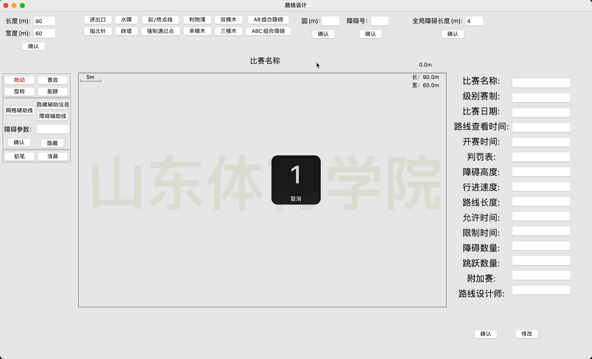
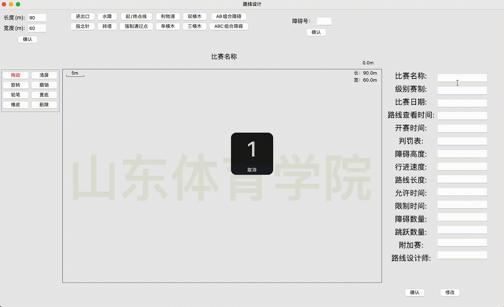

# Route_design
> 马术路线设计,通过拖拽快速制作马术路线图
### 界面预览

## 功能概览
### 1. 画布模块

- 路线图

  - 左上角为比例

  - 右上角为场地实时大小

  - 上方为比赛名称

  - 路线图右上方为路线长度

- 赛事信息区
  - 自定义比赛信息(支持确认后修改),可以随着场地的距离而改变位置，不填写不影响排版，会自动补齐（具体演示见下方）
- 左上方区域
  - 调整路线图的大小
- 右上方区域
  - 调整全局障碍物长度

### 2. 生产模块

- 点击在画布模块生成对应障碍物，详细操作在操作模块中进行

### 3. 操作模块

- 功能键
  - 拖动：选中后可以拖动障碍物
  - 旋转：鼠标滑动旋转障碍物，建议斜下方移动
  - 置底：障碍物放到底部
  - 删除：删除障碍物及障碍号
- 障碍物操作
  - 旋转：显示旋转的值，也可以自定义旋转的角度
  - 备注：可以为障碍物设置备注
  - 障碍物间距修改
    - 双横木使用厘米为单位
    - 横木之间使用米为单位

### 4.辅助模块

- 网格辅助线 - 开启后画布会显示间距为10米的网格
- 隐藏辅助信息 - 将路线图上的辅助信息隐藏，如：比例尺、实时大小、路线长度等（ps:辅助信息是除了障碍及路线的其他在路图如上的信息）
- 障碍参数 - 为障碍添加辅助信息，如障碍的高度等可以一键隐藏
- 长度测量 - 用来测量路线长度
- 清屏 - 将路线图上长度测量的线段全部清除（不包括障碍物）

### 6. 顶部菜单栏

- 工具栏与操作模块及辅助模块功能键相同

- 功能栏
  
  - 清屏：将路线图上的路线全部清除（不包括障碍物）
  
  - 保存（默认为"路线设计_时间.png"）
  - 打开文件保存位置
    - 会在软件的同级目录下创建ms_download文件夹，点击后打开
  
- 字号：修改线条的粗细(后设置的优先级高)

- 帮助
  - 关于软件：软件的版本信息
  - 帮助文档：点击跳转到帮助文档

## 功能详情演示

### 自定义比赛场地大小

通过输入框输入宽高(默认60x90),路线图右上角显示实时大小,左上角显示比例

### 自定义全局障碍长度

### 自定义障碍号
在输入框中输入障碍号，点击确定，会在路线图中的左上角显示出来，可以通过鼠标拖动移动，在操作模块点击删除功能删除

### 点击生成障碍杆及其操作
点击按钮生成障碍杆支持移动、删除、旋转、修改参数，双横木、三横木、组合障碍点击后可编辑距离、是否为双横木，可为每个障碍杆单独设置备注

### 长度测量

点击生成线段，按住自由测量，右上角显示实时路线长度

### 比赛信息
输入需要的，不填不影响，确认后可点击修改按钮修改信息

### 保存
默认为"路线设计_时间.png"

### 注意事项
- 多次点击同一个障碍杆后，右上角输入框可能会隐藏，点击输入框后会显示出来，不影响功能使用，
- 旋转输入框输入负整数会以360°减去对应的值，如：输入-10度会旋转350°
